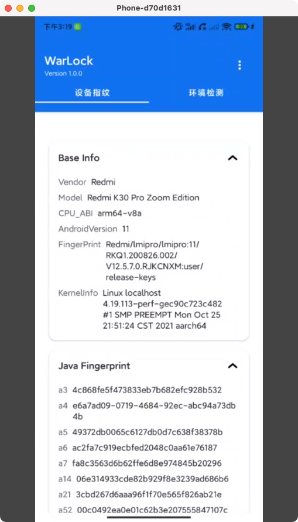
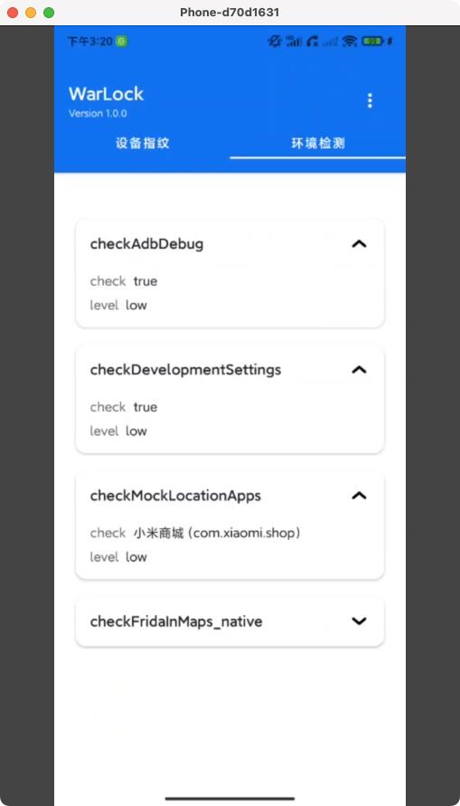

## 一、项目背景

​	本项目始于2024年年底创建的GitHub仓库，经过5个月的开发已初步实现核心功能。当前版本的服务端代码完成于2025年5月初，此后项目进入维护阶段。出于代码质量考虑，服务端部分暂未开源，待后续迭代优化后将考虑开放源代码。

​	项目初衷源于实际业务中对抗黑灰产的需求。在日常工作中，频繁需要开发新的检测模块来应对各类安全威胁。然而，采用每次新建独立项目或集中堆砌代码的方式都存在明显弊端。为此，我决定开发一个统一的安全检测SDK，以系统化地解决这一问题。

​	需要说明的是，当前版本仍存在诸多不足，主要提供了一些基础检测功能。在实际业务场景中，由于合规要求等限制因素，某些定制化检测方案往往难以直接落地。因此，理想的解决方案是针对特定类型的黑灰产工具，开发通用检测机制并结合用户行为分析(UBA)进行精准防御。这也是项目未来的重点发展方向。

## 二、Warlock介绍

​	Warlock项目地址：https://github.com/imxiaoc996/DeviceWarLock （release版本在本文章附件以及GitHub仓库中）

Warlock设备指纹分为java层和native层指纹，java层共计80+采集信息，native层共计20+采集信息，采集完毕后他们会形成一个json保存在log里，设备环境检测主要有Root、Unlock、云手机、沙箱、注入等检测手段，以下是能力汇总：

### 2.1 设备指纹采集能力

1. **基础硬件与系统信息采集**

- 设备品牌、型号、序列号

- Android系统版本、系统指纹、CPU架构

- 时区、数据目录、内存、存储空间等

2. **设备唯一标识采集**

- Android ID、Google Advertising ID（AAID）

- IMEI、UUID、蓝牙地址、MAC地址等

- DRM ID、Boot ID、ReaperAssignedDeviceId等

3. **WebView与系统环境指纹**

- WebView的UserAgent、分辨率、像素密度、GPU信息、字体列表

- WebView版本、系统语言

4. **系统服务与应用信息**

- 已安装应用列表、系统服务列表

- 系统字体哈希、屏幕亮度、分辨率、超时时间

------

### 2.2 设备环境检测能力

1. **虚拟环境与仿真检测**

- 检测模拟器（如传感器数量、摄像头数量、模拟器特征属性等）

- 检查云手机、沙箱环境

2. **安全风险检测**

- Root检测、Xposed检测、Hook检测、Unlock检测

- 签名校验、系统完整性检测

3. **系统环境异常检测**

- 检查开发者选项、USB调试、VPN连接等

- 检查自定义ROM（如LineageOS）特征

4. **电池与硬件状态检测**

- 电池状态、传感器、摄像头等硬件环境检测

## 三、写在最后

​	本文内容较为精简，主要介绍开源项目 **Warlock**。我们后续计划推进改机相关项目，但当前的重点仍是完善 Warlock 的核心功能。

​	尽管 Warlock 在现有安全检测工具中可能功能尚不完善，但作为开源项目，它希望能为对安全检测技术感兴趣的同学提供一些参考和帮助。

​	我们承诺至少会维护并迭代该项目一年。如果你有更好的检测方法，项目出现bug，或发现项目中尚未涵盖的技术方案，欢迎一起探讨，共同进步！